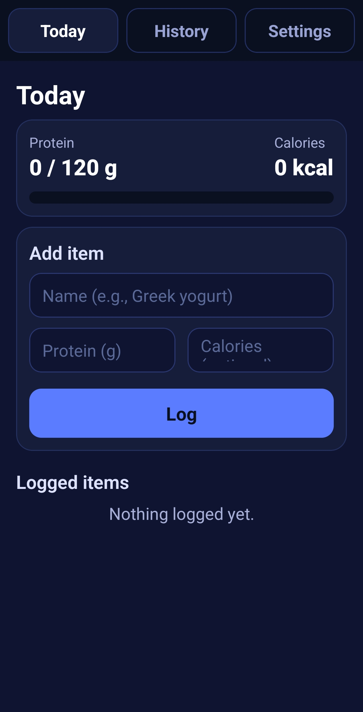
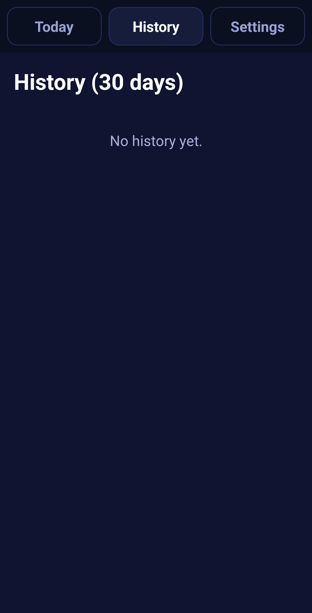
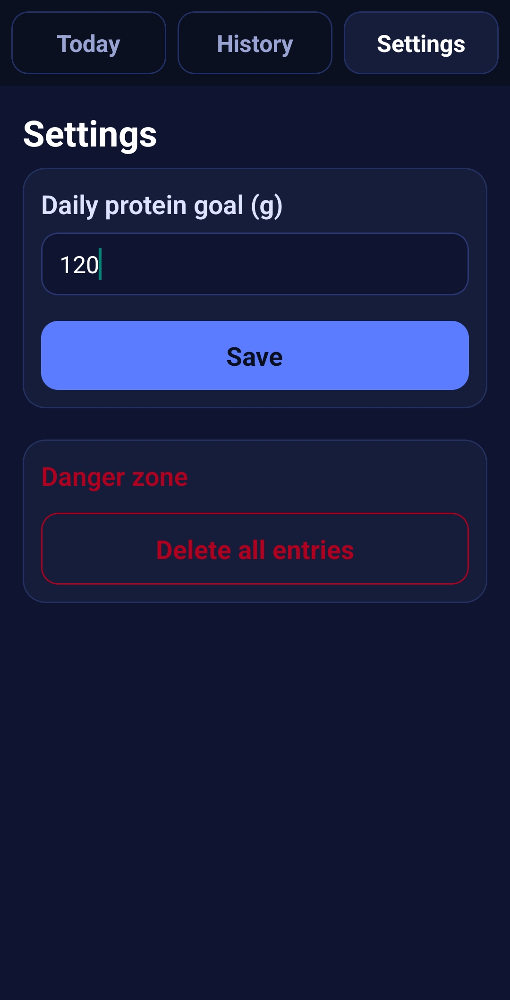

# 🥗 Protein Tracker

A simple, elegant mobile app for tracking daily protein and calorie intake. Built with React Native and Expo, featuring offline-first architecture with local SQLite storage. (This build is for Android.)

## ✨ Features

- **Daily Tracking**: Log protein and calorie intake throughout the day
- **Real-time Progress**: Visual progress bar showing daily protein goals
- **Entry Management**: Edit and delete logged items
- **30-Day History**: Review past nutrition logs
- **Customizable Goals**: Set and adjust daily protein targets
- **Offline-First**: All data stored locally using SQLite
- **Dark Mode UI**: Modern, eye-friendly interface

## 📱 Screenshots

| Today View | History | Settings |
|------------|---------|----------|
|  |  |  |

## 🚀 Try it Out

### Download APK
[Download the latest APK](YOUR_EAS_BUILD_LINK_HERE)

### Run Locally
```bash
# Clone the repository
git clone https://github.com/VerdieCraig/protein-tracker.git
cd protein-tracker

# Install dependencies
npm install

# Start the development server
npx expo start

# Scan the QR code with Expo Go app on your phone
```

## 🛠️ Tech Stack

- **React Native** - Cross-platform mobile framework
- **Expo** - Development platform and tooling
- **Expo Router** - File-based navigation
- **Expo SQLite** - Local database for offline storage
- **React Hooks** - Modern state management

## 📦 Project Structure

```
protein-tracker/
├── app/
│   ├── index.js          # Main app component with all screens
│   └── _layout.tsx       # Root layout wrapper
├── app.json              # Expo configuration
├── package.json          # Dependencies
└── README.md
```

## 🔧 Key Implementation Details

### Database Schema

**Settings Table:**
```sql
CREATE TABLE settings (
  id INTEGER PRIMARY KEY NOT NULL,
  goal_protein_g REAL NOT NULL
);
```

**Entries Table:**
```sql
CREATE TABLE entries (
  id INTEGER PRIMARY KEY NOT NULL,
  day TEXT NOT NULL,
  name TEXT NOT NULL,
  protein_g REAL NOT NULL,
  calories REAL,
  created_at TEXT NOT NULL
);
```

### Core Functionality

- **Async SQLite Operations**: Using the modern `expo-sqlite` async API
- **Date-based Filtering**: Entries grouped by day (YYYY-MM-DD format)
- **Real-time Calculations**: Automatic totals using React useMemo
- **Form State Management**: Edit mode with pre-populated fields

## 📝 Development Notes

### Building for Production

This app uses EAS Build for creating production builds:

```bash
# Install EAS CLI
npm install -g eas-cli

# Login to Expo
eas login

# Build APK for Android
eas build --platform android --profile preview

# Build for Play Store (AAB)
eas build --platform android --profile production
```

<!-- ### Future Enhancements

- [ ] Add meal categories (breakfast, lunch, dinner, snacks)
- [ ] Export data to CSV
- [ ] Weekly/monthly statistics and charts
- [ ] Barcode scanning for packaged foods
- [ ] Food database integration
- [ ] Macro breakdown (carbs, fats, protein percentages)
- [ ] Photo attachments for meals
- [ ] Cloud sync across devices
 -->
## 🤝 Contributing

Contributions, issues, and feature requests are welcome! Feel free to check the [issues page](https://github.com/VerdieCraig/protein-tracker/issues).

## 📄 License

This project is [MIT](LICENSE) licensed.

## 👤 Author

**Verdie Craig**
- GitHub: [@VerdieCraig](https://github.com/VerdieCraig)
- LinkedIn: [Your Name](https://linkedin.com/in/verdie-craig)
- Portfolio: [yourwebsite.com](https://verdie-craig-portfolio.onrender.com/)

## 🙏 Acknowledgments

- Built with [Expo](https://expo.dev)
- Icons from [Lucide](https://lucide.dev)
- Inspired by the need for simple, privacy-focused nutrition tracking

---

⭐ If you found this project helpful, please consider giving it a star!