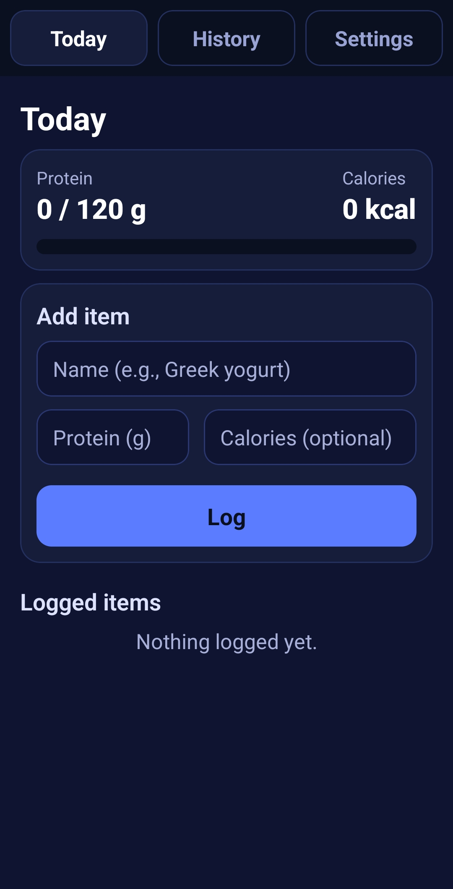
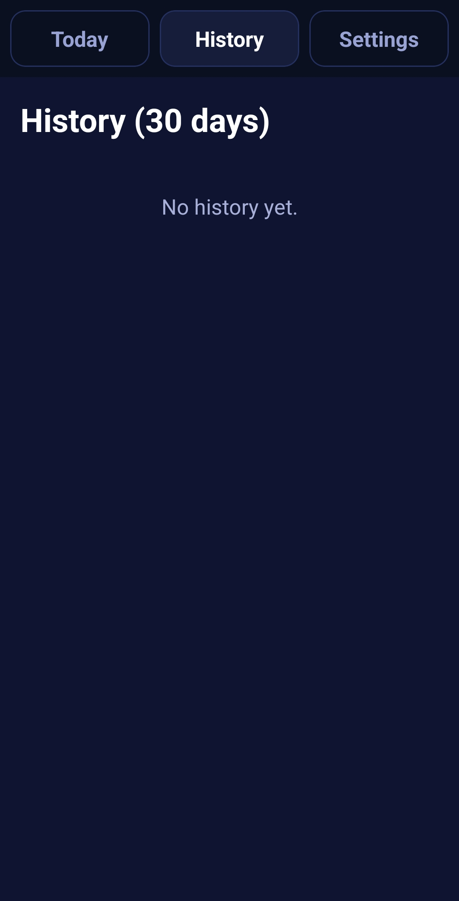
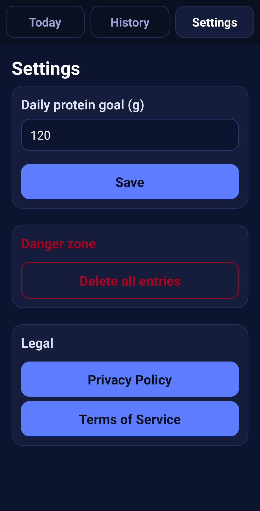
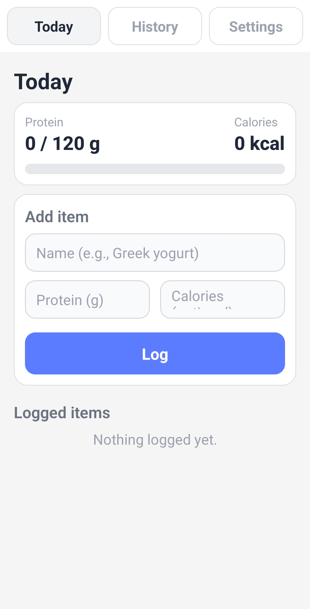
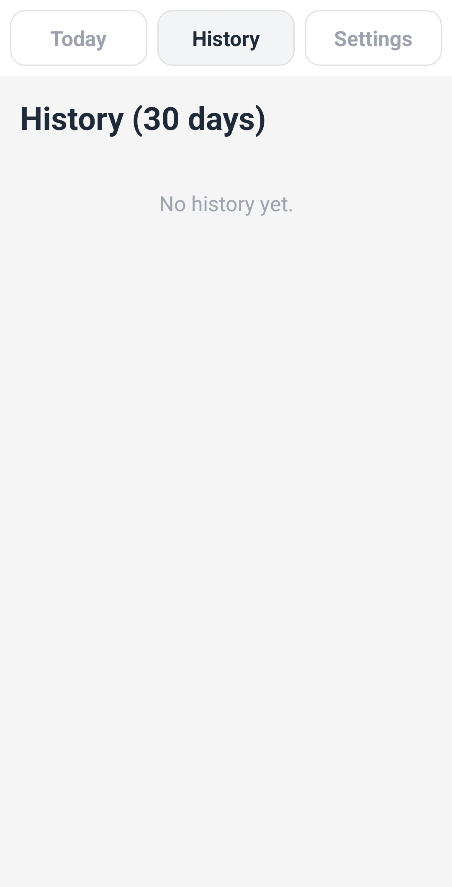
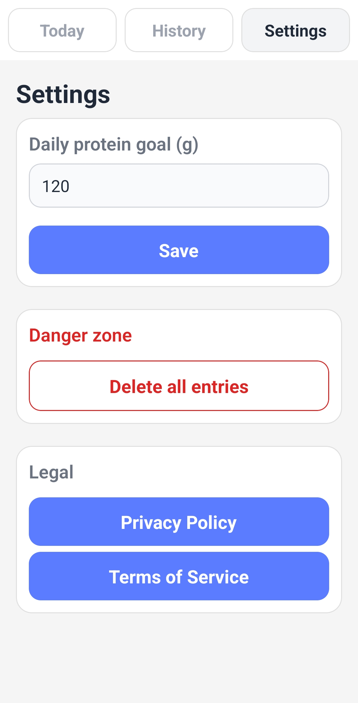

# 🥗 Protein Tracker

A simple, elegant Android mobile app for tracking daily protein and calorie intake. Built with React Native and Expo, featuring offline-first architecture with local SQLite storage and automatic light/dark mode support.

## ✨ Features

- **Daily Tracking**: Log protein and calorie intake throughout the day
- **Real-time Progress**: Visual progress bar showing daily protein goals
- **Entry Management**: Edit and delete logged items with ease
- **30-Day History**: Review past nutrition logs at a glance
- **Customizable Goals**: Set and adjust daily protein targets
- **Light & Dark Mode**: Automatically adapts to your device's appearance settings
- **Onboarding Tutorial**: First-time user guide with skip option
- **Offline-First**: All data stored locally using SQLite - no internet required
- **Privacy-Focused**: Your data never leaves your device

## 📱 Get the App

### Google Play Store
[Download from Google Play](#) *(Coming Soon)*

### Direct Download
[Download APK](https://github.com/VerdieCraig/protein-tracker/releases/latest)

## 📸 Screenshots

| Today View | History | Settings |
|:----------:|:-------:|:--------:|
|  |  |  |

*Supports both light and dark mode based on your device settings*

<details>
<summary>View Light Mode Screenshots</summary>

## 📸 Screenshots

| Today View | History | Settings |
|:----------:|:-------:|:--------:|
|  |  |  |

</details>

## 🎯 Why Protein Tracker?

- **Simple & Fast**: No accounts, no setup hassle - just open and start tracking
- **Privacy First**: Your nutrition data stays on your device, period
- **No Subscriptions**: Completely free, no premium tiers or paywalls
- **Offline Always**: Works without internet connection
- **Clean Interface**: Modern design that adapts to your system theme

## 🛠️ Tech Stack

- **React Native** - Cross-platform mobile framework
- **Expo** - Development platform and tooling
- **Expo Router** - File-based navigation
- **Expo SQLite** - Local database for offline storage
- **React Native WebView** - In-app legal document viewing
- **React Hooks** - Modern state management

## 📦 Project Structure

```
protein-tracker/
├── .vscode/              # VS Code workspace settings
├── app/
│   ├── index.js          # Main app component with all screens
│   └── _layout.tsx       # Root layout wrapper
├── assets/
│   ├── css/
│   │   └── style.scss    # GitHub Pages styling for legal docs
│   ├── fonts/            # Custom fonts
│   └── images/           # App images and icons
├── components/           # Reusable React components
├── constants/            # App-wide constants and config
├── hooks/                # Custom React hooks
├── screenshots/          # App screenshots for README
│   ├── today.jpg
│   ├── history.jpg
│   └── settings.jpg
├── scripts/              # Build and utility scripts
├── .gitignore            # Git ignore rules
├── LICENSE               # MIT License
├── README.md             # Project documentation
├── adaptive-icon.png     # Android adaptive icon
├── app.json              # Expo configuration
├── eas.json              # EAS Build configuration
├── eslint.config.js      # ESLint configuration
├── icon.png              # App icon
├── package.json          # Dependencies and scripts
├── package-lock.json     # Locked dependency versions
├── privacy-policy.md     # Privacy policy (hosted on GitHub Pages)
├── terms-of-service.md   # Terms of service (hosted on GitHub Pages)
└── tsconfig.json         # TypeScript configuration
```

## 🔧 Key Implementation Details

### Database Schema

**Settings Table:**
```sql
CREATE TABLE settings (
  id INTEGER PRIMARY KEY NOT NULL,
  goal_protein_g REAL NOT NULL
);
```

**Entries Table:**
```sql
CREATE TABLE entries (
  id INTEGER PRIMARY KEY NOT NULL,
  day TEXT NOT NULL,
  name TEXT NOT NULL,
  protein_g REAL NOT NULL,
  calories REAL,
  created_at TEXT NOT NULL
);
```

**Onboarding Table:**
```sql
CREATE TABLE onboarding (
  id INTEGER PRIMARY KEY NOT NULL,
  completed INTEGER NOT NULL DEFAULT 0
);
```

### Core Functionality

- **Async SQLite Operations**: Using the modern `expo-sqlite` async API
- **Date-based Filtering**: Entries grouped by day (YYYY-MM-DD format)
- **Real-time Calculations**: Automatic totals using React useMemo
- **Dynamic Theming**: Automatic light/dark mode based on system preferences
- **Form State Management**: Edit mode with pre-populated fields
- **First-time Onboarding**: 3-screen tutorial with skip functionality

## 🚀 Development

### Prerequisites

- Node.js 18+
- npm or yarn
- Expo CLI
- Android Studio (for Android development)

### Local Setup

```bash
# Clone the repository
git clone https://github.com/VerdieCraig/protein-tracker.git
cd protein-tracker

# Install dependencies
npm install

# Start the development server
npx expo start

# Run on Android device/emulator
npx expo start --android
```

### Building for Production

This app uses EAS Build for creating production builds:

```bash
# Install EAS CLI (if not already installed)
npm install -g eas-cli

# Login to Expo
eas login

# Build AAB for Google Play Store
eas build --platform android --profile production

# Build APK for direct distribution
eas build --platform android --profile preview
```

## 📱 Deployment

The app is published on Google Play Store. Legal documents (Privacy Policy and Terms of Service) are hosted on GitHub Pages for easy access and updates.

## 🤝 Contributing

Contributions, issues, and feature requests are welcome! Feel free to check the [issues page](https://github.com/VerdieCraig/protein-tracker/issues).

### Development Guidelines

1. Fork the repository
2. Create a feature branch (`git checkout -b feature/amazing-feature`)
3. Commit your changes (`git commit -m 'Add amazing feature'`)
4. Push to the branch (`git push origin feature/amazing-feature`)
5. Open a Pull Request

## 📄 License

This project is [MIT](LICENSE) licensed.

## 👤 Developer

**Dark Lotus Dev**
- Website: [https://darklotus.dev](https://darklotus.dev)
- Email: contact@darklotus.dev
- GitHub: [@VerdieCraig](https://github.com/VerdieCraig)

## 🔒 Privacy & Legal

- [Privacy Policy](https://verdiecraig.github.io/protein-tracker/privacy-policy)
- [Terms of Service](https://verdiecraig.github.io/protein-tracker/terms-of-service)

This app is committed to user privacy. All data is stored locally on your device and is never transmitted to external servers.

## 🙏 Acknowledgments

- Built with [Expo](https://expo.dev)
- Database powered by [SQLite](https://www.sqlite.org/)
- Inspired by the need for simple, privacy-focused nutrition tracking

---

⭐ If you found this project helpful, please consider giving it a star on GitHub!